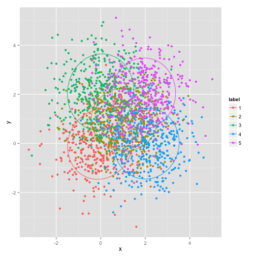

```r
library(mvtnorm)
set.seed(1234)
n <- 2000
l <- list(list(tau = 0.2, mu = c(0, 0), sigma = diag(2)), list(tau = 0.2, mu = c(1, 
    1), sigma = diag(2)), list(tau = 0.2, mu = c(0, 2), sigma = diag(2)), list(tau = 0.2, 
    mu = c(2, 0), sigma = diag(2)), list(tau = 0.2, mu = c(2, 2), sigma = diag(2)))
d <- as.matrix(cbind(rmvnorm(n * l[[1]]$tau, mean = l[[1]]$mu, sigma = l[[1]]$sigma), 
    1))
for (i in 2:length(l)) d <- rbind(d, cbind(rmvnorm(n * l[[i]]$tau, mean = l[[i]]$mu, 
    sigma = l[[i]]$sigma), i))
d <- data.frame(x = d[, 1], y = d[, 2], label = factor(d[, 3]))
library(ggplot2)
```

```
## Loading required package: methods
```

```r
library(devtools)
library(digest)
source_url("https://raw.github.com/low-decarie/FAAV/master/r/stat-ellipse.R")
```

```
## SHA-1 hash of file is 5fa2e55de033ed5a45b422ebaa230556bd7e236e
## Loading required package: proto
```

```r
ggplot(d, aes(x = x, y = y, colour = label, fill = label)) + geom_point() + 
    stat_ellipse()
```

```
## Loading required package: MASS
```

 

```r
# geom_density2d() sum(log(rowSums(sapply(l, function(x) x$tau *
# dmvnorm(d[,1:2], mean=x$mu, sigma=x$sigma)))))
l2 <- list(list(tau = 0.1, mu = c(0, 0), sigma = diag(2)), list(tau = 0.2, mu = c(1, 
    1), sigma = diag(2)), list(tau = 0.2, mu = c(0, 2), sigma = diag(2)), list(tau = 0.2, 
    mu = c(2, 0), sigma = diag(2)), list(tau = 0.3, mu = c(2, 2), sigma = diag(2)))
# sum(log(rowSums(sapply(l2, function(x) x$tau * dmvnorm(d[,1:2], mean=x$mu,
# sigma=x$sigma))))) plot(d, pch=20)
sum(do.call("rbind", by(d[, 1:2], d[, 3], function(x) as.list(sum(dist(x))))))
```

```
## [1] 704968
```


